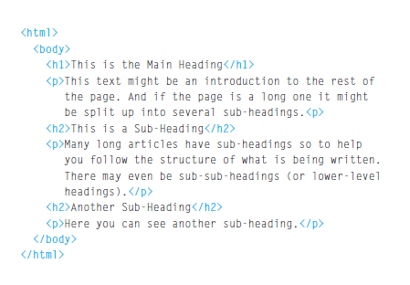

# The HTML Describes the Structure of Pages

</img>

there are two types of tages :-
* openinig tag `
`
* closing tag `
`

# Attributes
 Tell Us More About the Elements.

 Attributes provide additional information
about the contents of an element. They appear
on the opening tag of the element and are
made up of two parts: a name and a value,
separated by an equals sign.

## New HTML5 Layout Elements
HTML5 introduces a new set of elements that allow you to divide up the
parts of a page. The names of these elements indicate the kind of content
you will find in them. They are still subject to change, but that has not
stopped many web page authors using them already.

# Script :-
A script is a series of instructions that a
computer can follow to achieve a goal.

## writing script steps

1. DEFINE THE GOAL
First, you need to define the task you want to
achieve. You can think of this as a puzzle for the
computer to solve.
2. DESIGN THE SCRIPT
To design a script you split the goal out into a series
of tasks that are going to be involved in solving this
puzzle. This can be represented using a flowchart.
You can then write down individual steps that the
computer needs to perform in order to complete
each individual task (and any information it needs to
perform the task), rather like writing a recipe that it
can follow.
3. CODE EACH STEP
Each of the steps needs to be written in a
programming language that the compu ter
understands. In our case, this is JavaScript.

<a href="README.md">HOME</a>