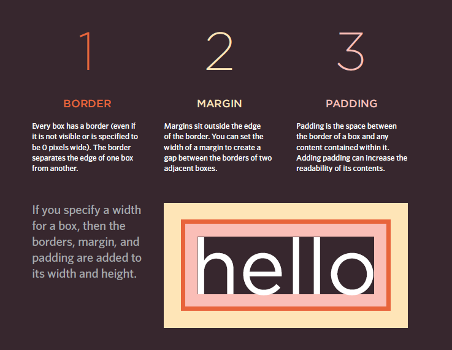

## the listes
* Ordered lists are lists where each item in the list is
numbered. For example, the list might be a set of steps for
a recipe that must be performed in order, or a legal contract
where each point needs to be identified by a section
number.
* Unordered lists are lists that begin with a bullet point
(rather than characters that indicate order).
* Definition lists are made up of a set of terms along with the
definitions for each of those terms.

# Dimentions `(width,height)`

By default a box is sized just big
enough to hold its contents. To
set your own dimensions for a
box you can use the height and
width properties.
The most popular ways to
specify the size of a box are
to use pixels, percentages, or
ems. Traditionally, pixels have
been the most popular method
because they allow designers to
accurately control their size.
When you use percentages,
the size of the box is relative to
the size of the browser window
or, if the box is encased within
another box, it is a percentage of
the size of the containing box.
When you use ems, the size
of the box is based on the size
of text within it. Designers
have recently started to use
percentages and ems more for
measurements as they try to
create designs that are flexible
across devices which have
different-sized screens.

</img>

<a href="README.md">HOME</a>