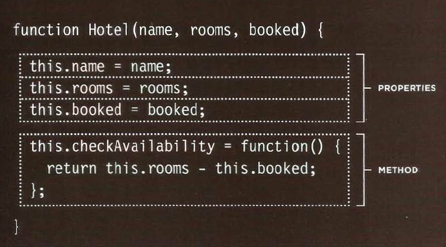
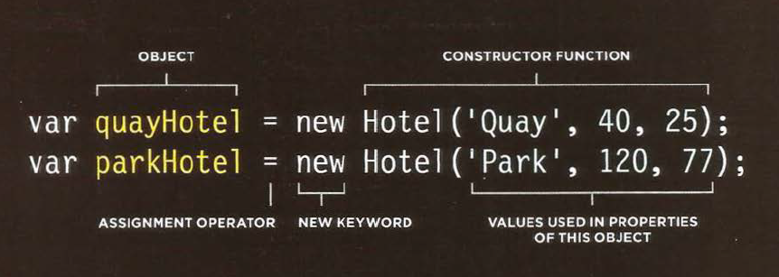

# Tables
A table represents information in a grid format.
Examples of tables include financial reports, TV
schedules, and sports results.
## Table tags 
* `<table>`

The `<table>` element is used
to create a table. The contents
of the table are written out row
by row.

* `<tr>`

You indicate the start of each
row using the opening `<tr>` tag.
(The tr stands for table row.)
It is followed by one or more
`<td>` elements (one for each cell
in that row).
At the end of the row you use a
closing `</tr>` tag.

* `<td>`

Each cell of a table is
represented using a `<td>`
element. (The td stands for
table data.)
At the end of each cell you use a
closing `</td>` tag.

* `<th>`

The `<th>` element is used just
like the `<td>` element but its
purpose is to represent the
heading for either a column or
a row. (The th stands for table
heading.)

# functions and methods 
CREATING MANY OBJECTS:
CONSTRUCTOR NOTATION
Sometimes you will want several objects to represent similar things.
Object constructors can use a function as a template for creating objects.
First, create the template with the object's properties and methods.
</img>
</img>
<a href="README.md">HOME</a>