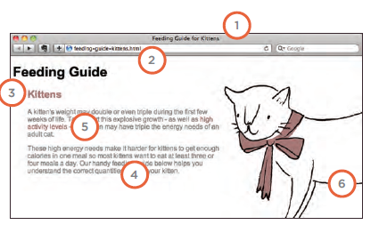

# IMAGES

You can control the size of an
image using the width and
height properties in CSS, just
like you can for any other box.

By default, images are inline
elements. This means that they
flow within the surrounding text.
In order to center an image, it
should be turned into a blocklevel
element using the display
property with a value of block.
Once it has been made into a
block-level element, there are
two common ways in which you
can horizontally center an image:
1: On the containing element,
you can use the text-align
property with a value of center.
2: On the image itself, you can
use the use the margin property
and set the values of the left and
right margins to auto.

## Background Position

The background-image
property allows you to place
an image behind any HTML
element.

When an image is not being
repeated, you can use the
background-position
property to specify where in the
browser window the background
image should be placed.
This property usually has a pair
of values. The first represents
the horizontal position and the
second represents the vertical.

* left top
* left center
* left bottom
* center top
* center center
* center bottom
* right top
* right center
* right bottom

In every page of your website there are seven key places where keywords
(the words people might search on to find your site) can appear in order
to improve its findability.
On-Page SEO
1. Page Title
The page title appears at the top
of the browser window or on the
tab of a browser. It is specified in
the `<title>` element which lives
inside the `<head>` element.
2. URL / Web Address
The name of the file is part of
the URL. Where possible, use
keywords in the file name.
3. Headings
If the keywords are in a heading
<hn> element then a search
engine will know that this page is
all about that subject and give it
greater weight than other text.
4. Text
Where possible, it helps to
repeat the keywords in the main
body of the text at least 2-3
times. Do not, however, over-use
these terms, because the text
must be easy for a human to
read.
5. Link Text
Use keywords in the text that
create links between pages
(rather than using generic
expressions such as "click here").
6. Image Alt Text
Search engines rely on you
providing accurate descriptions
of images in the alt text. This
will also help your images show
up in the results of image-based
searches.
7. Page Descriptions
The description also lives inside
the <head> element and is
specified using a <meta> tag.
It should be a sentence that
describes the content of the
page. (These are not shown in
the browser window but they
may be displayed in the results
pages of search engines.)
Never try to fool search engines!
They will penalize you for it. For
example, never add text in the
same color as the background of
the page as they can detect this.

<a href="README.md">HOME</a>